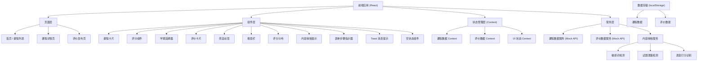
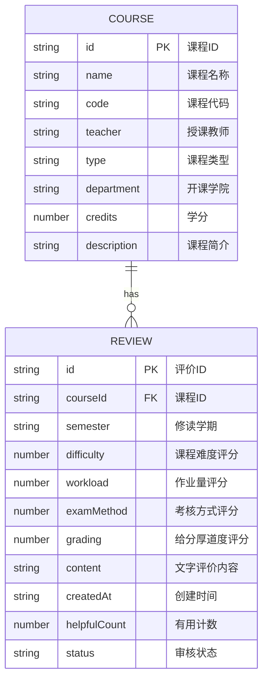

## 1. 架构设计



## 2. 技术说明

- **前端框架**：React 18 + TypeScript
- **构建工具**：Vite 5
- **样式方案**：TailwindCSS 3 + PostCSS
- **路由管理**：React Router DOM 6
- **图标库**：Lucide React
- **状态管理**：React Context + useReducer
- **数据持久化**：localStorage（模拟后端存储）
- **数据方案**：Mock 数据 + 本地存储，无需后端服务
- **字体方案**：Google Fonts (Noto Serif SC + Noto Sans SC)

## 3. 路由定义

| 路由路径 | 页面名称 | 主要功能 |
|---------|---------|---------|
| `/` | 首页 / 课程列表 | 课程搜索、筛选、课程卡片展示 |
| `/course/:courseId` | 课程详情页 | 课程信息、评价列表、评分统计 |
| `/review/new` | 评价发布页 | 分步表单、多维度评分、内容审核 |
| `/about` | 关于页 | 平台介绍、使用规范 |

## 4. 数据模型

### 4.1 实体关系图



### 4.2 TypeScript 类型定义

```typescript
// 课程类型
export type CourseType = 'major_required' | 'general' | 'interdisciplinary';

export interface Course {
  id: string;
  name: string;
  code: string;
  teacher: string;
  type: CourseType;
  department: string;
  credits: number;
  description: string;
  reviews?: Review[];
}

// 评价类型
export interface Review {
  id: string;
  courseId: string;
  semester: string; // 格式: "2024-2025-1"
  difficulty: number; // 1-5
  workload: number; // 1-5
  examMethod: number; // 1-5
  grading: number; // 1-5
  content: string;
  createdAt: string;
  helpfulCount: number;
  status: 'pending' | 'approved' | 'rejected';
}

// 评分维度
export interface RatingDimensions {
  difficulty: number;
  workload: number;
  examMethod: number;
  grading: number;
}

// 审核结果
export interface ContentReviewResult {
  passed: boolean;
  warnings: string[];
  blockedReasons: string[];
  detectedIssues: ContentIssue[];
}

export interface ContentIssue {
  type: 'sensitive_word' | 'exam_leak' | 'malicious_rating';
  severity: 'warning' | 'block';
  message: string;
  position?: { start: number; end: number };
}

// 筛选条件
export interface FilterOptions {
  type: CourseType | 'all';
  sortBy: 'rating' | 'review_count' | 'latest';
  searchQuery: string;
}
```

### 4.3 Mock 数据初始化

系统预置 12 门课程数据和 30+ 条评价数据，覆盖：
- 专业必修课：高等数学、数据结构、操作系统、计算机网络
- 通识课：大学英语、军事理论、创新创业基础
- 跨院课：心理学概论、金融学基础、艺术鉴赏

## 5. 内容审核模块核心逻辑

### 5.1 敏感词检测

- 预置敏感词库：政治敏感、低俗词汇、人身攻击词汇
- 检测方式：正则匹配 + 关键词模糊匹配
- 处理策略：
  - 严重敏感词：直接拦截，禁止提交
  - 一般敏感词：警告提示，建议修改

### 5.2 试题泄露检测

- 检测规则：
  - 包含"考题"、"试题"、"期末题"、"考点"等关键词
  - 包含具体题目描述（如"选择题第3题考了XXX"）
  - 包含答案相关内容
- 处理策略：检测到即拦截，提示"评价内容不得包含考试题及答案"

### 5.3 恶意打分识别

- 检测规则：
  - 所有维度全打 1 分且文字内容为空或无意义
  - 所有维度全打 5 分且文字内容为空或无意义
  - 同一用户对同一课程多次评价且评分极端
- 处理策略：警告提示，建议补充具体评价内容

## 6. 项目目录结构

```
/
├── src/
│   ├── components/          # 可复用组件
│   │   ├── CourseCard.tsx
│   │   ├── ReviewCard.tsx
│   │   ├── RatingStars.tsx
│   │   ├── SemesterPicker.tsx
│   │   ├── SearchBar.tsx
│   │   ├── FilterTabs.tsx
│   │   ├── RatingDistribution.tsx
│   │   ├── ContentReviewAlert.tsx
│   │   ├── StepIndicator.tsx
│   │   └── Toast.tsx
│   ├── pages/               # 页面组件
│   │   ├── Home.tsx
│   │   ├── CourseDetail.tsx
│   │   └── NewReview.tsx
│   ├── context/             # 状态管理
│   │   ├── CourseContext.tsx
│   │   └── ReviewContext.tsx
│   ├── services/            # 业务逻辑
│   │   ├── courseService.ts
│   │   ├── reviewService.ts
│   │   └── contentReviewService.ts
│   ├── data/                # Mock 数据
│   │   ├── courses.ts
│   │   └── reviews.ts
│   ├── types/               # TypeScript 类型
│   │   └── index.ts
│   ├── utils/               # 工具函数
│   │   ├── semester.ts
│   │   ├── storage.ts
│   │   └── rating.ts
│   ├── App.tsx
│   ├── main.tsx
│   └── index.css
├── index.html
├── vite.config.ts
├── tailwind.config.js
├── tsconfig.json
└── package.json
```
