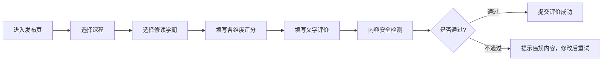

## 1. 产品概述

高校选课经验墙是一个面向大学生的课程评价分享平台，帮助新生根据往届学生的真实选课体验做出明智的课程选择，同时通过内容审核机制保障评价质量。

- 核心目标：为学生提供真实、可靠的课程评价，辅助选课决策
- 目标用户：高校在读学生（评价者）、新生（信息获取者）
- 核心价值：打破信息不对称，避免踩坑，提升选课体验

## 2. 核心特性

### 2.1 用户角色

| 角色 | 注册方式 | 核心权限 |
|------|---------|----------|
| 学生用户 | 学号/邮箱注册 | 发布评价、浏览评价、筛选课程、举报不良内容 |
| 审核用户 | 管理员账号 | 审核评价、删除违规内容、管理敏感词库 |

### 2.2 功能模块

1. **首页（课程列表页）**：课程搜索、筛选（专业必修/通识/跨院）、评价概览
2. **评价发布页**：多维度评价表单、学期选择、内容校验
3. **课程详情页**：课程信息、评价列表、评价详情展示
4. **内容审核模块**：敏感词检测、恶意打分识别、试题泄露拦截

### 2.3 页面详情

| 页面名称 | 模块名称 | 功能描述 |
|---------|---------|----------|
| 首页 | 搜索区域 | 支持按课程名、教师名搜索 |
| 首页 | 筛选区域 | 按课程类型（专业必修/通识/跨院）筛选，支持按评分、评价数排序 |
| 首页 | 课程卡片 | 展示课程名、教师、平均评分、评价数量、课程类型标签 |
| 评价发布页 | 课程选择 | 选择要评价的课程和教师 |
| 评价发布页 | 学期选择 | 选择修读学期（格式：2024-2025-1） |
| 评价发布页 | 评价维度 | 课程难度、作业量、考核方式、给分厚道度四个维度打分 |
| 评价发布页 | 文字评价 | 详细文字描述体验，支持最多500字 |
| 评价发布页 | 内容校验 | 实时检测敏感词、试题泄露内容 |
| 课程详情页 | 课程信息 | 课程基本信息、评分分布、评价统计 |
| 课程详情页 | 评价列表 | 展示所有评价，支持按学期、评分筛选 |
| 课程详情页 | 评价卡片 | 展示学期、各维度评分、文字内容、举报按钮 |

## 3. 核心流程

### 3.1 浏览评价流程

### 3.2 发布评价流程

## 4. 用户界面设计

### 4.1 设计风格

- **主色调**：学术蓝（#1E3A8A）代表严谨与专业，辅以活力橙（#F97316）作为强调色
- **辅助色**：薄荷绿（#10B981）表示好评，珊瑚红（#EF4444）表示差评
- **按钮风格**：圆角矩形，微阴影，悬停时有轻微放大和颜色加深效果
- **字体**：标题使用 "Noto Serif SC" 衬线字体体现学术感，正文使用 "Noto Sans SC" 保证可读性
- **布局风格**：卡片式布局，清晰的信息层级，适当留白
- **图标风格**：线性简洁图标，配合文字标签

### 4.2 页面设计概览

| 页面名称 | 模块名称 | UI 元素 |
|---------|---------|--------|
| 首页 | Hero 区域 | 大标题"选课经验墙"，副标题"学长学姐帮你避坑"，背景使用淡蓝色渐变 + 网格纹理 |
| 首页 | 搜索栏 | 圆角搜索框，带放大镜图标，右侧筛选按钮 |
| 首页 | 筛选标签 | 可切换的标签组：全部、专业必修、通识课、跨院课 |
| 首页 | 课程卡片 | 顶部课程名称和类型标签，中间教师名和评分条，底部评价数和最新评价学期 |
| 评价发布页 | 表单区域 | 左侧步骤指示器，右侧表单内容，分步填写 |
| 评价发布页 | 评分组件 | 星级评分或滑块评分，四个维度横向排列 |
| 课程详情页 | 评分概览 | 大数字显示平均分，下方四个维度的评分条 |
| 课程详情页 | 评价卡片 | 顶部学期标签和发布时间，中间评分和文字，底部操作区（有用/举报） |

### 4.3 响应式设计

- 桌面端优先设计，最大宽度 1200px 居中布局
- 平板端：课程卡片从 3 列变为 2 列
- 移动端：课程卡片单列布局，筛选标签横向滚动，底部导航栏
- 触摸优化：按钮最小高度 44px，足够的点击区域

### 4.4 视觉特效

- 页面加载时卡片依次淡入（staggered animation）
- 课程卡片悬停时轻微上浮 + 阴影加深
- 评分选择时的颜色渐变动画
- 内容审核通过/不通过的状态提示动画
- 学期标签的年份徽章效果
